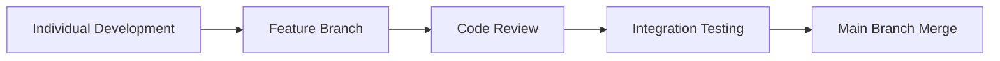

# 📱 Weather Dashboard - Project Task Division

<div align="center">

**CPAN 213 - Cross-Platform Mobile Development**  
**Group Assignment 2-3**

---

**📅 Deadline:** November 3, 2025  
**👥 Team Size:** 4 Developers  
**⚛️ Platform:** Expo CLI + React Native  
**📊 Weight:** 10% of Final Grade

---

</div>

## 🎯 Project Overview

### 📋 Project Summary
The **Weather Dashboard** is an advanced mini-app designed to provide users with comprehensive weather information through an intuitive mobile interface. This cross-platform application demonstrates modern mobile development practices using React Native and Expo CLI.

### 🌟 Project Objectives
- Deliver real-time weather data through seamless API integration
- Provide an engaging user experience with animations and interactive components  
- Implement multi-screen navigation for enhanced functionality
- Demonstrate professional mobile development workflows and collaboration

### 🏗️ **Architecture Decision: `src/` Structure**
**📁 We are using traditional `src/` folder organization with React Navigation instead of Expo Router**

**Why this decision benefits our team:**
- **⚡ Simplicity:** Standard React Native patterns that all team members understand
- **📚 Resources:** Extensive tutorials and documentation available online
- **⏰ Time Efficient:** No additional package installation or learning curve overhead
- **👥 Team Collaboration:** Easier coordination with familiar, industry-standard structure
- **🔧 Already Configured:** React Navigation dependencies are already installed and ready

**vs. Expo Router Alternative:**
- Expo Router requires additional setup (`npx create-expo-app --template tabs`)
- File-based routing adds complexity for team coordination
- Less documentation available for troubleshooting
- Additional learning curve during time-constrained project

**📂 Our Project Structure:**
```
src/
├── components/     # Reusable UI (Developer 1, 2, 3)
├── screens/       # App screens (Developer 4)
├── navigation/    # Navigation config (Developer 4)  
├── services/      # API integration (Developer 1)
└── utils/         # Shared utilities (All developers)
```

### 💡 Why Weather Dashboard?
| Advantage | Description |
|-----------|-------------|
| **🌍 Universal Appeal** | Weather information is globally relevant and engaging |
| **⚙️ Feature Alignment** | Natural support for all assignment requirements |
| **🔌 API Availability** | Free, reliable weather APIs (OpenWeatherMap) |
| **📚 Learning Value** | Covers core React Native concepts and real-world patterns |

---

## 👨‍💻 Task Distribution & Responsibilities

### <span style="color: #ff6b6b; font-weight: bold; font-size: 1.2em;">🔗 DEVELOPER 1: API Integration & Progress Management</span>
> **Weight:** 15% | **Focus:** Data Layer & User Feedback

#### 📋 Primary Responsibilities
- **API Integration:** Implement weather data retrieval from OpenWeatherMap API
- **Progress Indicators:** Design and integrate loading states during data fetch operations
- **Error Handling:** Manage API failures and provide meaningful user feedback

#### 🛠️ Technical Deliverables
```javascript
// Example Implementation Structure
- Weather API service layer (src/services/weatherAPI.js)
- Progress bar/spinner components (src/components/LoadingSpinner.js)
- Error boundary handling (src/utils/errorHandler.js)
- Data caching mechanisms (src/services/storage.js)
```

#### 💼 Professional Value
Master asynchronous data handling, API management, and state management - essential skills for modern mobile development.

#### 🚀 Quick Start Guide
1. **API Setup:** Register at [OpenWeatherMap](https://openweathermap.org/api) (free tier)
2. **Endpoints:** Current weather (`/weather`) + 5-day forecast (`/forecast`)
3. **Testing:** Use mock data during development for consistent testing

---

### <span style="color: #4ecdc4; font-weight: bold; font-size: 1.2em;">🎮 DEVELOPER 2: Interactive Components & Gestures</span>
> **Weight:** 15% | **Focus:** User Interaction & Touch Experience

#### 📋 Primary Responsibilities
- **Custom Components:** Create unique touchable elements beyond standard examples
- **Gesture Recognition:** Implement intuitive refresh mechanisms (pull-to-refresh or custom buttons)
- **User Experience:** Ensure smooth, responsive interactions with visual feedback

#### 🛠️ Technical Deliverables
```javascript
// Implementation Focus Areas
- PanResponder or enhanced Touchable components
- Custom refresh interactions
- Haptic feedback integration
- Visual state transitions

// File Location: src/components/CustomButton.js
// Integration: Import into src/screens/ as needed
```

#### 💼 Professional Value
Develop expertise in mobile-specific interaction patterns and user experience design principles.

#### 🎨 Design Considerations
- Scale animations on press (0.95x transform)
- Ripple effects for Android compatibility
- Clear visual feedback for all interactions

---

### <span style="color: #45b7d1; font-weight: bold; font-size: 1.2em;">✨ DEVELOPER 3: Modals, Notifications & Animations</span>
> **Weight:** 32.5% (Modals: 15% + Animations: 17.5%) | **Focus:** User Interface Polish

#### 📋 Primary Responsibilities
**Modals & Notifications (15%)**
- Implement confirmation dialogs for user actions
- Create error/success notification systems  
- Design information modals for detailed weather data

**Animations (17.5%)**
- Integrate spring and timing animations
- Animate weather icons and data transitions
- Create smooth screen transitions and micro-interactions

#### 🛠️ Technical Deliverables
```javascript
// Animation Examples
- Spring animations for weather icons (src/components/AnimatedWeatherIcon.js)
- Timing animations for data appearance (src/components/FadeInText.js)
- Modal slide-in/fade transitions (src/components/WeatherModal.js)
- Loading state animations (src/components/LoadingSpinner.js)
```

#### 💼 Professional Value
Master React Native's Animated API and user feedback systems - crucial for creating polished, professional mobile applications.

#### 🎭 Animation Strategy
| Component | Animation Type | Duration | Effect |
|-----------|---------------|----------|--------|
| Weather Icons | Spring | 800ms | Bounce entrance |
| Temperature Display | Timing | 300ms | Fade in |
| Modal Appearance | Spring | 400ms | Scale + fade |
| Loading States | Loop | Infinite | Rotation/pulse |

---

### <span style="color: #f7b731; font-weight: bold; font-size: 1.2em;">🧭 DEVELOPER 4: Navigation & Project Documentation</span>
> **Weight:** 37.5% (Navigation: 17.5% + Video: 20%) | **Focus:** App Architecture & Presentation

#### 📋 Primary Responsibilities
**Navigation Architecture (17.5%)**
- Implement multi-screen navigation using React Navigation
- Create intuitive navigation patterns (tabs, stack, or hybrid)
- Design consistent navigation UI/UX across all screens

**Video Documentation (20%)**
- Produce professional 5-minute demonstration video
- Script comprehensive feature walkthrough
- Coordinate final submission materials

#### 🛠️ Technical Deliverables
```javascript
// Navigation Structure (src/navigation/AppNavigator.js)
// Using React Navigation Stack/Tab Navigator
HomeStack (Current Weather) → src/screens/HomeScreen.js
├── ForecastScreen (5-day forecast) → src/screens/ForecastScreen.js
├── SavedLocationsScreen (Favorites) → src/screens/SavedLocationsScreen.js
└── SettingsScreen (User preferences) → src/screens/SettingsScreen.js
```

#### 💼 Professional Value
Gain expertise in app architecture, navigation patterns, and technical presentation skills - essential for senior development roles.

#### 🎬 Video Production Guidelines
| Section | Duration | Content Focus |
|---------|----------|---------------|
| Introduction | 30s | App purpose & team introduction |
| Feature Demo | 3m 30s | All interactive elements & navigation |
| Technical Highlights | 45s | Code architecture & implementation |
| Conclusion | 15s | Summary & team credits |

---

## 🤝 Collaboration Framework

### 📋 **Development Workflow**


### 🔄 **Communication Protocol**
- **📅 Weekly Sync:** Every Wednesday, 7:00 PM EST
- **💬 Daily Updates:** Slack/Discord progress check-ins
- **🚨 Blockers:** Immediate escalation via group chat
- **📝 Documentation:** Real-time updates in shared documents

### 🛠️ **Technical Standards**
| Category | Standard | Tool/Method |
|----------|----------|-------------|
| **Version Control** | Git Flow | GitHub with feature branches |
| **Code Style** | ESLint + Prettier | Auto-formatting on commit |
| **Testing** | Unit + Integration | Jest + Expo testing tools |
| **Documentation** | JSDoc comments | Inline code documentation |

---

## 📦 Submission Checklist

### 🎯 **Final Deliverables**
- [ ] **Complete source code** (excluding node_modules)
- [ ] **Professional demo video** (5 minutes, HD quality)
- [ ] **Setup documentation** (README with installation steps)  
- [ ] **Team contribution log** (individual responsibility tracking)

### 📁 **File Structure Requirements**
```
CPAN_213_{TeamLeader}_Assignment_2_3.zip
├── src/                          # Main source code (NOT using Expo Router)
│   ├── components/               # Reusable UI components
│   │   ├── CustomButton.js       # Developer 2: Interactive components
│   │   ├── LoadingSpinner.js     # Developer 1: Progress indicators
│   │   ├── AnimatedWeatherIcon.js# Developer 3: Animations
│   │   └── WeatherModal.js       # Developer 3: Modals
│   ├── screens/                  # App screens
│   │   ├── HomeScreen.js         # Developer 4: Main weather display
│   │   ├── ForecastScreen.js     # Developer 4: 5-day forecast
│   │   └── SavedLocationsScreen.js # Developer 4: Favorites
│   ├── navigation/               # Navigation setup
│   │   └── AppNavigator.js       # Developer 4: React Navigation config
│   ├── services/                 # External integrations
│   │   ├── weatherAPI.js         # Developer 1: API integration
│   │   └── storage.js            # Developer 1: Data persistence
│   └── utils/                    # Shared utilities
│       ├── constants.js          # All: Shared constants
│       └── helpers.js            # All: Utility functions
├── assets/                       # Images, fonts, icons
├── App.js                        # Root component with navigation
├── package.json                  # Dependencies (React Navigation included)
├── README.md                     # Setup instructions
└── TEAM_CONTRIBUTIONS.md         # Individual responsibility tracking
```

### 🕒 **Timeline Milestones**
| Date | Milestone | Responsibility |
|------|-----------|----------------|
| **Oct 25** | Individual features complete | All developers |
| **Oct 28** | Integration & testing phase | Team collaboration |
| **Oct 30** | Video recording & final polish | Developer 4 + Team |
| **Nov 2** | Final submission preparation | Team leader |
| **Nov 3** | Project submission deadline | **FINAL DEADLINE** |

---

## 🎯 Success Metrics

### 📊 **Technical Excellence**
- ✅ All API calls function reliably with error handling
- ✅ Smooth animations at 60fps on target devices  
- ✅ Intuitive navigation with consistent UX patterns
- ✅ Professional code quality with proper documentation

### 🏆 **Team Achievement**
- ✅ Equal contribution from all team members
- ✅ Effective collaboration and communication
- ✅ On-time delivery with quality standards
- ✅ Professional presentation and documentation

---

## 💡 Pro Tips for Excellence

### 🔧 **Technical Best Practices**
- **Performance:** Use React.memo for expensive components
- **Security:** Never commit API keys (use .env files)
- **Testing:** Test on both iOS and Android via Expo Go
- **Accessibility:** Include proper labels and screen reader support

### 🎨 **Design Guidelines**
- **Color Palette:** Weather-themed blues, whites, and accent colors
- **Typography:** Clear, readable fonts with proper hierarchy
- **Icons:** Consistent icon family (Expo Vector Icons recommended)
- **Spacing:** Use consistent padding/margin values (8px grid)

### 🚀 **Deployment Readiness**
- **Code Quality:** ESLint passing, no console warnings
- **Performance:** Smooth performance on mid-range devices
- **Documentation:** Complete README with setup instructions
- **Video Quality:** HD recording with clear audio narration

---

<div align="center">

**🌟 Let's Build Something Amazing Together! 🌟**

*Professional mobile development through effective teamwork and technical excellence*

</div>