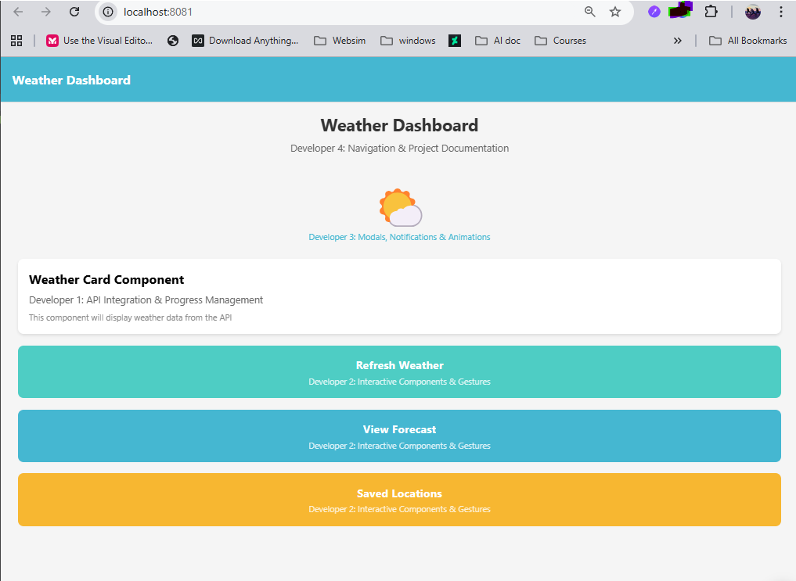

<div align="center">

# 🌤️ Weather Dashboard - React Native App

</div>

| 🎯 **Priority** | 📄 **Document** | 📝 **Description** |
|:--------------:|:---------------|:------------------|
| **1 - CRITICAL** | [📋 **ProjectTask.md**](./ProjectInfo/ProjectTask.md) | **Complete developer assignments & task breakdown** |
| **2 - SETUP** | [🚀 **TEAM_SETUP_GUIDE.md**](./ProjectInfo/TEAM_SETUP_GUIDE.md) | **Required versions & installation steps** |
| **3 - STRUCTURE** | [📁 **PROJECT_STRUCTURE_COMPLETE.md**](./ProjectInfo/PROJECT_STRUCTURE_COMPLETE.md) | **File organization & developer focus areas** |
| **4 - REFERENCE** | [🏗️ **RECOMMENDED_STRUCTURE.md**](./ProjectInfo/RECOMMENDED_STRUCTURE.md) | **Architecture decisions & best practices** |

---

## 🌃 **Recommended Development Theme**

> **💡 This project is optimized for [Tokyo Night theme](./TOKYO_NIGHT_SETUP.md)**  
> VS Code settings are pre-configured for the best development experience!

---

## 📱 Quick Project Overview

**Assignment Due:** November 3, 2025 | **Team:** 4 Developers | **Platform:** iOS/Android

Real-time weather dashboard with forecasts, location management, and interactive animations.

## ✨ Features

- **Current Weather Display** - Real-time weather conditions
- **7-Day Forecast** - Extended weather predictions  
- **Location Management** - Save and manage multiple locations
- **Interactive Animations** - Smooth weather-related animations
- **Offline Storage** - Save preferences and favorite locations
- **Responsive Design** - Optimized for mobile devices

## 🛠️ Tech Stack

- **React Native** 0.81.4
- **Expo SDK** 54.0.16  
- **React Navigation** 7.1.18
- **AsyncStorage** 2.2.0
- **OpenWeatherMap API** - Weather data source

## 🚀 Quick Start

### Prerequisites
- Node.js v20.19.4+
- npm 11.6.2+
- Expo CLI 54.0.12
- Expo Go app on your mobile device

### Installation & Setup

```bash
# Clone the repository
git clone <repository-url>
cd WeatherDashboard

# Install dependencies
npm install

# Start development server
npm start

# Scan QR code with Expo Go app on your phone
```

### Alternative Commands

```bash
# Start with tunnel for team sharing
npm run mobile

# Run on Android emulator
npm run android

# Run on iOS simulator (macOS only)
npm run ios
```

## 📁 Project Structure

> **📋 See [PROJECT_STRUCTURE_COMPLETE.md](./ProjectInfo/PROJECT_STRUCTURE_COMPLETE.md) for complete file details**

```
src/ ← All development happens here
├── components/     # Reusable UI (Developer 1,2,3)
├── screens/        # App screens (Developer 4)  
├── navigation/     # React Navigation (Developer 4)
├── services/       # API integration (Developer 1)
└── utils/          # Shared utilities (All)
```

## 👥 Team Development

<div align="center">



*Weather Dashboard Main Screen Preview*

</div>

> **🎯 See [ProjectTask.md](./ProjectInfo/ProjectTask.md) for complete developer assignments and detailed task breakdown**

**Quick Developer Reference:**
- **Developer 1** - API Integration & Weather Components
- **Developer 2** - Interactive Components & UI Enhancement  
- **Developer 3** - Animations & Weather Icons
- **Developer 4** - Navigation & Screen Management

## 🔑 API Configuration

**Developer 1:** Update `src/utils/constants.js` with your OpenWeatherMap API key.

> **� See [ProjectTask.md](./ProjectInfo/ProjectTask.md) for complete API setup instructions**

## 📱 Testing & Deployment

### Quick Testing
```bash
npm start          # Start development server
# Scan QR with Expo Go app
```

### Team Setup
> **🚀 See [TEAM_SETUP_GUIDE.md](./ProjectInfo/TEAM_SETUP_GUIDE.md) for complete installation & version requirements**

## 📚 Resources

- [React Native Documentation](https://reactnative.dev/)
- [Expo Documentation](https://docs.expo.dev/)
- [React Navigation Docs](https://reactnavigation.org/)
- [OpenWeatherMap API Docs](https://openweathermap.org/api)

## 📄 License

This project is created for educational purposes as part of CPAN 213 Mobile App Development course.

---

**Need Help?** Check the troubleshooting guides in the project documentation or contact your team members!

🌤️ Built with ❤️ by the Weather Dashboard Team
